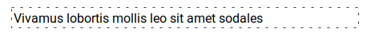
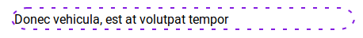
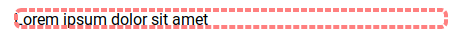

# react-border
React library for creating SVG border around children property.

# Installation

```sh
npm install react-border
```

# API
```js
Border.propTypes = {
  children: PropTypes.node.isRequired,
  className: PropTypes.string,
  radius: PropTypes.number,
  size: PropTypes.number,
}

Border.defaultProps = {
  className: '',
  radius: 5,
  size: 4,
}
```

# How to use it

## Example 1
<p align='center'>
  
</p>

```html
<Border className='example-1' radius={30} size={10}>
  <div style={{ padding: 15 }}>
    Nam eu pretium mi, nec ornare nisl
  </div>
</Border>
```

```css
.example-1__in {
  stroke-dasharray: 8 2;
  stroke: #2f416d;
}
```

## Example 2
<p align='center'>
  
</p>

```html
<Border className='example-2' radius={10}>
  <div style={{ padding: 5 }}>
    Interdum et malesuada fames
  </div>
</Border>
```

```css
.example-2__in {
  stroke-dasharray: 10 3;
  stroke: #ffba92;
}
```

## Example 3
<p align='center'>
  
</p>

```html
<Border className='example-3' radius={0} size={1}>
  <div style={{ padding: 3 }}>
    Vivamus lobortis mollis leo sit amet sodales
  </div>
</Border>
```

```css
.example-3__in {
  stroke-dasharray: 3 8;
}
```

## Example 4
<p align='center'>
  
</p>

```html
<Border className='example-4' radius={20} size={2}>
  <div style={{ padding: 4 }}>
    Donec vehicula, est at volutpat tempor
  </div>
</Border>
```

```css
.example-4__in {
  stroke: #851de0;
}
```

## Example 5
<p align='center'>
  
</p>

```html
<Border className='example-5' radius={5}>
  Lorem ipsum dolor sit amet
</Border>
```

```css
.example-5__in {
  stroke-dasharray: 6 2;
  stroke: #ff8080;
}
```